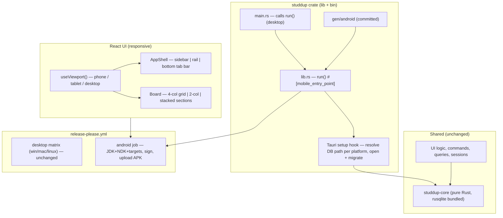

# Mobile (Android) Port — Design

**Spec:** `.specs/features/mobile-android/spec.md`
**Context:** `.specs/features/mobile-android/context.md`
**Status:** Draft

---

## Visual Source of Truth (handoff)

The mobile/tablet screens are designed and approved. Build the UI against these handoff files (local
reference under the gitignored `design/` dir — not versioned, per the maintainer's choice):

- **Shells:** `design/handoff/project/ShellCelular.dc.html` (bottom tab bar + Novo Card emphasis),
  `design/handoff/project/ShellTablet.dc.html` (icon rail + **theme toggle in the rail footer**, RWD-08).
- **Board:** `QuadroCelular.dc.html` (stacked HOJE→AMANHÃ→PRÓXIMOS→CONCLUÍDOS), `QuadroTablet.dc.html`
  (2×2), `QuadroProvaCelular.dc.html`, `QuadroProvaTablet.dc.html`.
- **Sheets (phone modals):** `SheetDetalheCard.dc.html`, `SheetAdiar.dc.html`, `SheetNovoCard.dc.html`,
  `SheetNovaProva.dc.html`, `SheetExcluir.dc.html`.
- **Sessions:** the `Sessao*.dc.html` screens at 390px (Pomodoro/Recall/Feynman/Leitner/Nenhuma).
- **PNGs (whole-flow reference / future store shots):** `design/images/mobile/*.png`.

Columns are exactly Hoje / Amanhã / Próximos / Concluídos (the earlier "A Estudar/Revisado" drift is
corrected). Known cosmetic nit: the `Studdup Shells.dc.html` *backdrop* still shows the old column
labels — ignore it; `QuadroCelular/Tablet` are authoritative.

---

## Architecture Overview

The port has three independent tracks that meet at the CI release: **(1) make the app crate
buildable for Android** (lib + mobile entry point, platform-resolved DB path), **(2) make the React
UI responsive** across phone/tablet/desktop, and **(3) build + sign + publish the APK** in the
existing release workflow. Nothing in `studdup-core` changes — the domain, scheduling and persistence
are already platform-neutral pure Rust with `rusqlite` `bundled`.

---

## Code Reuse Analysis

### Existing Components to Leverage

| Component | Location | How to Use |
| --- | --- | --- |
| `studdup-core` (all of it) | `studdup-core/` | Reuse unchanged. `rusqlite` already `bundled` → cross-compiles to Android NDK. |
| `paths::default_db_path()` | `studdup/src/paths.rs` | Keep as the **desktop** path resolver, called from the setup hook (not from `main` pre-builder). |
| `state::init_state(path)` | `studdup/src/state.rs` | Reuse verbatim — it already opens + migrates + refuses a blank DB. Just call it from the setup hook with the resolved path. |
| The `narrow` viewport pattern | `AppShell.tsx:68-101` | Generalize the single `window.innerWidth < 1024` boolean into a `useViewport()` hook returning `'phone' \| 'tablet' \| 'desktop'`. |
| `MethodSwitcher` segmented control | `ui/src/components/MethodSwitcher.tsx` | Visual precedent for any segmented control; reused as-is (it already sits above the board). |
| `BoardColumn` / `placeCard` / `groupByColumn` | `ui/src/components/Board.tsx` | Reuse the grouping + column rendering; only the **container** changes (grid → stacked/2-col) and columns size-to-content on phone. |
| `ModalShell`, `useEscapeToClose` | `ui/src/components/ModalShell.tsx`, `ui/src/lib/useEscapeToClose.ts` | Modals already close on ESC/outside-click; add touch-friendly sizing + a full-screen sheet variant on phone. |
| `tokens.css` design tokens | `ui/src/styles/tokens.css` | The token system is the responsive foundation; add spacing/size tokens only if needed. |
| release workflow (desktop matrix) | `.github/workflows/release-please.yml` | Add an Android job alongside; reuse the `Resolve release id from tag` step + `releaseId` upload pattern. |

### Integration Points

| System | Integration Method |
| --- | --- |
| Tauri path API | `app.path().app_data_dir()` in the setup hook resolves the Android sandbox dir; desktop branch uses the existing env-based path. |
| Tauri mobile | `tauri android init` generates `gen/android`; `#[cfg_attr(mobile, tauri::mobile_entry_point)]` on `run()` wires the Android activity to the shared app. |
| tauri-action (CI) | Android build + APK produced in the Android job; signed via gradle config reading CI secrets; uploaded to the release resolved by tag. |

---

## Components

### 1. `studdup` crate → lib + bin split

- **Purpose**: expose a single `run()` app entry usable by desktop (`main.rs`) and the generated
  Android project, via the Tauri mobile entry point.
- **Location**: `studdup/src/lib.rs` (new), `studdup/src/main.rs` (slimmed to call `run()`).
- **Interfaces**:
  - `pub fn run()` — annotated `#[cfg_attr(mobile, tauri::mobile_entry_point)]`; builds the Tauri
    app, registers plugins + the existing command handlers, and installs the setup hook.
  - `fn main()` — `studdup_lib::run()` only (desktop), keeping the `windows_subsystem` attribute.
- **Dependencies**: `tauri` (mobile feature enabled by target), `studdup-core`.
- **Reuses**: the entire `invoke_handler!` registry from `main.rs`; `state::AppState`.
- **Note**: `Cargo.toml` for `studdup` gains a `[lib]` (`crate-type = ["staticlib", "cdylib", "rlib"]`
  as Tauri mobile requires) plus the `[[bin]]`.

### 2. Platform-aware DB path in the setup hook

- **Purpose**: resolve the DB path correctly on every platform, then open + migrate before the app
  serves the UI, preserving the "never open a blank DB" invariant on mobile.
- **Location**: setup closure inside `run()` (`lib.rs`); desktop resolver stays in `paths.rs`.
- **Interfaces**:
  - Desktop/`not(mobile)`: `paths::default_db_path()` (unchanged behavior).
  - Mobile: `app.path().app_data_dir()?.join("srs.db")`, creating the dir.
  - On `init_state` error: surface a fatal state (log + a minimal error UI / managed error flag)
    instead of `std::process::exit(1)` (which is wrong on Android). Desktop keeps its
    exit-with-message path.
- **Dependencies**: `tauri::Manager` (for `app.path()`), `state::init_state`.
- **Reuses**: `state::init_state`, `paths::default_db_path`.

### 3. `useViewport()` hook

- **Purpose**: one source of truth for the active breakpoint, replacing the ad-hoc `narrow` boolean.
- **Location**: `ui/src/lib/useViewport.ts` (new) + `ui/src/lib/useViewport.test.ts`.
- **Interfaces**:
  - `type Viewport = 'phone' | 'tablet' | 'desktop'`
  - `useViewport(): Viewport` — subscribes to `resize`, returns the bucket for `window.innerWidth`
    (`< 640` phone, `< 1024` tablet, else desktop). SSR/no-`window` safe → `'desktop'`.
  - `export function viewportFor(width: number): Viewport` — pure, unit-tested (breakpoint edges).
- **Dependencies**: none.
- **Reuses**: the resize-listener pattern already in `AppShell`.

### 4. Responsive `AppShell` → adds bottom tab bar (phone)

- **Purpose**: render nav as sidebar (desktop) / icon rail (tablet) / **bottom tab bar** (phone).
- **Location**: `ui/src/components/AppShell.tsx` (edit) + `ui/src/components/BottomNav.tsx` (new).
- **Interfaces**:
  - `AppShell` chooses chrome by `useViewport()`: `desktop` → existing sidebar; `tablet` → existing
    collapsed rail; `phone` → `<BottomNav>` fixed to the bottom + no left rail, content fills width.
  - `BottomNav({ route, onNavigate, onNewCard })` — a fixed bottom bar of the primary routes with
    Novo Card emphasized; ≥44px targets; safe-area padding (`env(safe-area-inset-bottom)`).
- **Dependencies**: `ROUTES`, `NavGlyph`, `useViewport`.
- **Reuses**: `ROUTES`, `NavGlyph`, `NovoCardButton` styling, the theme/state plumbing already in
  `AppShell`. The method switcher stays promoted above the board (AD-009) at every breakpoint.
- **Theme-in-collapsed-rail fix (RWD-08)**: the collapsed `Sidebar` rail currently renders no theme
  control (only the *expanded* sidebar footer has the `ThemePill`s) — so Claro/Escuro vanishes when
  collapsed, on tablet **and** on desktop-collapsed (Ctrl/⌘+B). Add a compact theme toggle (a sun/moon
  icon button) to the rail footer that flips `light`↔`dark` via the existing `onChooseTheme`. This is
  a small pre-existing-bug fix that the mobile work naturally surfaces; it benefits desktop too. Phone
  needs nothing extra — `Configuracoes.tsx` already hosts a theme control reachable from the bottom
  bar's Configurações tab.

### 5. Responsive `Board` → stacked (phone) / 2-col (tablet) / 4-col (desktop)

- **Purpose**: reflow the four columns by breakpoint without changing placement logic.
- **Location**: `ui/src/components/Board.tsx` (edit) + `ui/src/components/Board.test.ts` (extend).
- **Interfaces**:
  - The container grid becomes breakpoint-driven: desktop `repeat(4, 1fr)` (unchanged), tablet
    `repeat(2, 1fr)`, phone single column with each `BoardColumn` **sized to content** (no inner
    scroll; the page scrolls). A tiny pure helper `boardGridColumns(viewport)` is unit-tested.
  - `BoardColumn` gains a `stacked` flag: when stacked, drop `overflowY:auto`/`minHeight:0` so the
    column grows to its cards and the sticky header still works within the page scroll.
- **Dependencies**: `useViewport`, existing `columns.ts` helpers.
- **Reuses**: `groupByColumn`, `placeCard`, `BoardColumn`, `EmptyState` — all unchanged in behavior.

### 6. Touch-friendly modals / sheets

- **Purpose**: make detail/adiar/novo-card/session usable by touch on phone (full-width sheet,
  ≥44px controls, dismiss by touch).
- **Location**: `ui/src/components/ModalShell.tsx` (edit) — add a phone "sheet" sizing branch driven
  by `useViewport`.
- **Reuses**: `ModalShell`, `useEscapeToClose` (outside-click already closes).

### 7. CI Android job + signing + docs

- **Purpose**: build, sign and publish the APK per release; document install/build.
- **Location**: `.github/workflows/release-please.yml` (edit), `.github/release-please-config.json`
  (Android version sync), `studdup/gen/android/app/build.gradle.kts` (signing config), `README.md` +
  `SETUP.md`.
- **Interfaces (workflow job `android`)**: checkout → setup JDK 17 → setup Android SDK/NDK → `rustup
  target add aarch64-linux-android armv7-linux-androideabi i686-linux-android x86_64-linux-android` →
  build UI (`npm ci && npm run build`) → decode keystore from secret → `tauri android build
  --apk` (or via tauri-action) → upload `*.apk` to the release resolved by tag. `fail-fast: false`
  so it never blocks the desktop matrix.
- **Secrets**: `ANDROID_KEY_BASE64`, `ANDROID_KEY_ALIAS`, `ANDROID_KEY_PASSWORD`,
  `ANDROID_STORE_PASSWORD` (maintainer-provisioned).
- **Reuses**: the `Resolve release id from tag` + `releaseId` upload pattern already in the workflow.

---

## Data Models (if applicable)

No new data models. Schema, migrations and all tables are unchanged (`studdup-core`). The only data
concern is **where** the SQLite file lives per platform (see component 2).

---

## Error Handling Strategy

| Error Scenario | Handling | User Impact |
| --- | --- | --- |
| Android app-data dir unresolvable | Setup hook returns error → fatal error UI/log, no blank DB | Clear failure instead of silent data loss (MIG invariant, DATA-04). |
| DB open/migrate fails on mobile | Same fatal path (managed error flag surfaced by the UI), not `process::exit` | App shows an error state rather than a blank, data-less board. |
| Desktop path resolution after refactor | Unchanged env-based path; behavior identical to today | Existing users' data opens from the same location (DATA-03). |
| CI signing secrets missing (fork PR) | Android job fails clearly at the signing step (or is guarded to skip on forks) | No unsigned/broken APK is ever published (edge case). |
| Very narrow width (~320px) | Layout uses min-content-safe flex/grid, wrapping | Graceful, no horizontal overflow (RWD-01). |

---

## Risks & Concerns

| Concern | Location (file:line) | Impact | Mitigation |
| --- | --- | --- | --- |
| DB init runs in `main()` before the Tauri builder, using env vars unavailable on Android | `studdup/src/main.rs:16-27`, `studdup/src/paths.rs:16-31` | On Android it would fall to the relative `data/srs.db` fallback — wrong, possibly unwritable | Move DB open+migrate into the Tauri `setup` hook with a platform branch (component 2); desktop path unchanged. |
| `process::exit(1)` as the fatal-DB mechanism | `studdup/src/main.rs:24` | Not a valid failure mode on Android (kills the activity abruptly, no message) | Mobile branch surfaces a managed error state/log instead; desktop keeps exit-with-message. |
| UI is 100% inline styles, no CSS media queries | `AppShell.tsx`, `Board.tsx`, most components | Can't lean on CSS breakpoints; every responsive branch must be JS-driven | Centralize on `useViewport()` (component 3); pure `viewportFor`/`boardGridColumns` helpers are unit-tested so the branching is verifiable without a browser. |
| `list_board` returns only active cards; board derives spaced due date client-side (AD-003/AD-014) | `Board.tsx:11-13, 91-95` | Reflow must not disturb placement logic or exam-cursor placement | Reflow touches only the **container** and column chrome; `groupByColumn`/`placeCard`/`placeAtDue` stay byte-for-byte. |
| Android emulator SQLite crash reports exist in the wild for non-bundled setups | (external: tauri#8879) | Runtime crash if SQLite isn't statically bundled | Already mitigated — `rusqlite` uses `features=["bundled"]`; verify no dynamic `libsqlite3` linkage sneaks in. |
| Committing `gen/android` adds a large generated tree | `studdup/gen/android/**` | Repo weight + review noise | Accepted (AD-017): needed for reproducible signed builds; add a focused `.gitignore` for gradle build outputs (`gen/android/app/build`, `.gradle`). |
| No test can run the real Android app in this environment | — | Can't prove device runtime here | Prove what's provable: Rust build/tests for the lib split + path logic (host), UI breakpoint tests, and CI dry-run of the Android job; device smoke test is the maintainer's release check (documented). |

---

## Tech Decisions (only non-obvious ones)

| Decision | Choice | Rationale |
| --- | --- | --- |
| Where DB init happens | Tauri `setup` hook, not `main()` | Only there is the platform path resolver available; lets desktop and Android share `init_state` with different paths. |
| Responsive mechanism | JS `useViewport()` hook, not CSS media queries | The codebase is inline-styles-only; a hook is the single consistent lever and its pure helpers are unit-testable. |
| Breakpoints | phone `<640`, tablet `<1024`, desktop `≥1024` | 1024 already exists as the sidebar auto-collapse edge (AD-009); 640 is the standard phone/tablet split. Recorded as AD-017. |
| Phone board layout | Stacked full-width sections (not a column switcher) | Least divergence, reuses `BoardColumn`, and surfaces "Hoje" first — matches the app's due-now ethos (confirmed with user). |
| Phone nav | Bottom tab bar | Thumb-reachable, mobile-native, frees horizontal space (confirmed with user). |
| Tablet nav/board | Existing icon rail + 2-column board | Reuses AD-009 rail; 2-col is the natural middle density (confirmed: tablets are first-class). |
| APK signing | Self-signed release keystore via CI secrets | Sideloaded APKs must be signed to install; Play Store deferred (AD-017). |

> **Project-level decisions:** recorded as **AD-017** in `.specs/STATE.md` (Android target, local-first,
> identifier rename, lib+bin split, platform DB path, three-breakpoint responsive model).
