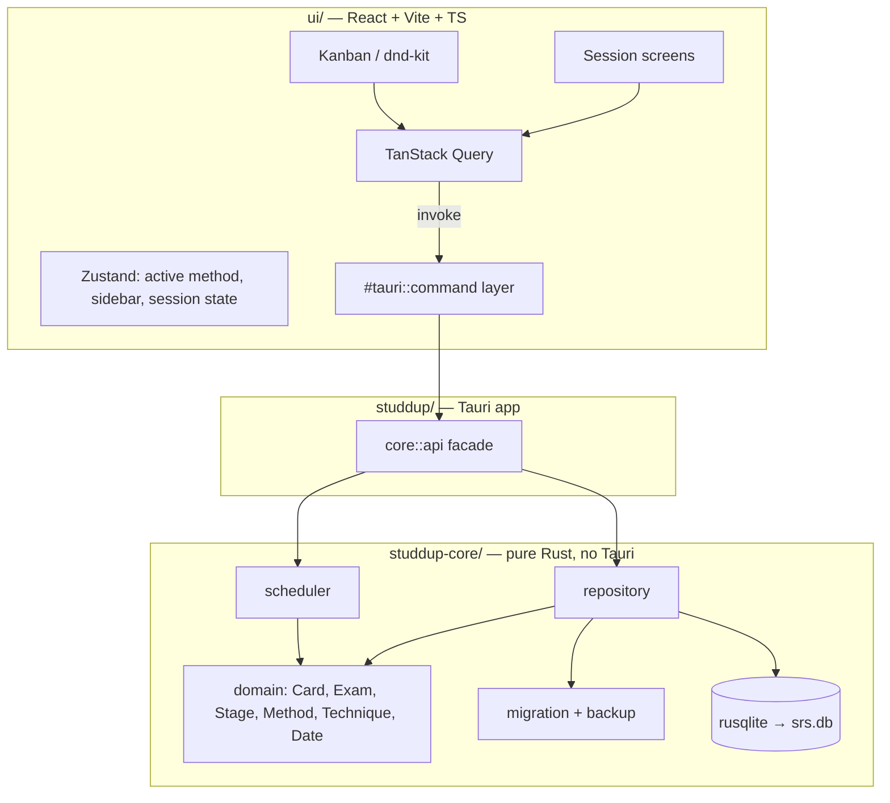

# Study Methods & Techniques — Design

**Spec:** `.specs/features/study-methods/spec.md`
**Status:** Draft

Conforms to STATE decisions AD-001..010. Frontend framework fixed to **React** (user). Key architecture
confirmed with the user: **A** three-layer Cargo workspace, **B** rusqlite in a pure core, **C1** hybrid
scheduling (spaced-repetition derived, exam-prep materialized), **D** React Query + Zustand + dnd-kit.

---

## Architecture Overview

A Cargo workspace with a pure, Tauri-free core (all domain logic, scheduling, persistence, migration) and a
thin Tauri command layer that the React UI calls. This mirrors the C++ layering (`Date`/`Card`/`Scheduler`/
`DatabaseManager` were already UI-free) and is what keeps the 70% coverage gate meaningful — tests link the
core alone, exactly as the C++ CI did with `BUILD_APP=OFF`.



**Request flow (example — drag a card Hoje→Amanhã):** dnd-kit `onDragEnd` → Zustand optimistic move →
`invoke('postpone_card', {id, days:1})` → command → `core::api::postpone_card` → `scheduler::postpone`
(re-anchors `startDate`) → `repository::update_card` + `record_event` → returns updated `Card` → TanStack
Query cache reconciles. On error the optimistic move is rolled back and a toast shows.

---

## Code Reuse Analysis

### Existing Components to Leverage

The C++ sources are the **behavioral specification** for the port (kept on a `legacy/cpp` branch per AD, not
compiled). Port — do not import — these:

| Component | Location | How to Use |
| --- | --- | --- |
| `Scheduler` (pure stage transitions) | `src/Scheduler.cpp/.h` | Port 1:1 to `core/scheduler/spaced.rs`; the stage-as-offset math and restart/erase/postpone/revive are the reference behavior (AD-003). |
| `Date` (local-tz today, ISO, arithmetic) | `src/Date.cpp/.h` | Port to `core/domain/date.rs`. Prefer `time`/`chrono` crate for correctness but keep the same ISO string surface for DB compat. |
| `Card` / `Stage` / `HistoryEvent` | `src/Card.h` | Port to `core/domain/`; extend with `method`, `technique`, session-length fields (see Data Models). |
| `DatabaseManager` schema + WAL + prepared stmts | `src/DatabaseManager.cpp` | Reference for the `repository` module; reuse the exact table/column names of `cards` and `events` so the same `.db` file opens. |
| Existing unit tests | `tests/test_date.cpp`, `tests/test_scheduler.cpp` | Port each assertion to Rust `#[test]`s; they lock the ladder 0/1/2/5/15/30 and re-anchor behavior. |
| Overdue Restart/Erase + 5-min postpone timer | `src/ui/CardEditor.cpp` | UX behaviors to reproduce in React (context.md flags them as valued). |

### Integration Points

| System | Integration Method |
| --- | --- |
| Existing `srs.db` (C++ data) | Same file path (`%APPDATA%/studdup/srs.db`), opened by rusqlite; forward migration adds columns/tables (MIG-01/02). |
| OS default handler for links | Tauri `opener` plugin (`open` in shell) — never exec as a command (spec edge case). |
| OS file reveal (Configurações) | Tauri `opener`/`reveal_item_in_dir`. |
| Desktop notifications (Pomodoro end) | Tauri `notification` plugin. |

---

## Components

### core::domain

- **Purpose**: Pure data types and the two study vocabularies — no I/O.
- **Location**: `studdup-core/src/domain/` (`date.rs`, `card.rs`, `exam.rs`, `enums.rs`, `event.rs`).
- **Interfaces**:
  - `Date::today() -> Date`, `add_days`, `days_until`, `from_iso`/`to_iso` — port of C++ `Date`.
  - `enum Method { SpacedRepetition, ExamPrep }`
  - `enum Stage { Day0=0, Day1=1, Day2=2, Day5=5, Day15=15, Day30=30, Done=-1 }` — value **is** the day offset (AD-003).
  - `enum Technique { Pomodoro, ActiveRecall, Feynman, Leitner }` (+ `Option<Technique>` = none).
  - `struct PomodoroRhythm { focus_min: u16, break_min: u16 }` with presets 25/5, 50/10, 90/20.
- **Dependencies**: `time` (or `chrono`) for date math only.
- **Reuses**: C++ `Card.h`, `Date` semantics.

### core::scheduler

- **Purpose**: All due-date computation and stage/session transitions, dispatched by `Method` (C1 hybrid).
- **Location**: `studdup-core/src/scheduler/` (`mod.rs`, `spaced.rs`, `exam.rs`).
- **Interfaces** (pure; take value, return updated value — same discipline as C++):
  - `due_date(card, sessions?) -> Date` — spaced: `start_date + stage`; exam: date of the current cursor session.
  - `is_due_today/tomorrow/overdue(card, today)`, `overdue_days(...)`.
  - `mark_completed(card, today) -> Transition` — spaced: `next_stage`, archive after Day30; exam: advance cursor, archive after last session.
  - `restart_study` / `erase_study` / `revive` / `postpone(card, days)` — spaced re-anchors `start_date` (AD-003); exam shifts the current session date.
  - `exam::distribute(today, exam_date) -> Vec<Date>` — the EXAM-02 formula `round(S·(i/(N-1))^0.62)`, with the `S=30 → [0,13,20,25,30]` property covered by a test (EXAM-03).
- **Dependencies**: `core::domain`.
- **Reuses**: `Scheduler.cpp` 1:1 for the spaced path.

### core::repository

- **Purpose**: All SQLite reads/writes; the only module that knows SQL.
- **Location**: `studdup-core/src/repository/` (`mod.rs`, `cards.rs`, `exams.rs`, `events.rs`, `migration.rs`).
- **Interfaces**: `insert_card`, `update_card`, `delete_card`, `load_active(method)`, `load_archived(method)`,
  `insert_exam`, `load_exams`, `delete_exam_cascade`, `insert_sessions`, `advance_session`, `record_event`,
  `load_history(scope)`, `migrate(conn) -> MigrationReport`.
- **Dependencies**: `rusqlite` (bundled SQLite), `core::domain`.
- **Reuses**: `DatabaseManager.cpp` schema, WAL pragma, prepared-statement pattern.

### core::api

- **Purpose**: The single facade the Tauri layer calls — orchestrates scheduler + repository + event logging
  in one place (the "apply*" pattern from the C++ `App`), so the command layer stays dumb.
- **Location**: `studdup-core/src/api.rs`.
- **Interfaces**: one function per user action (`create_card`, `complete_card`, `postpone_card`,
  `restart_card`, `erase_card`, `revive_card`, `edit_card`, `delete_card`, `create_exam`, `delete_exam`,
  `list_board(method, today)`, `list_history(scope)`, `record_session(card, focused_secs, self_rating?)`).
- **Dependencies**: `core::scheduler`, `core::repository`.
- **Reuses**: the C++ `App::applyMarkCompleted/applyRestart/...` orchestration shape.

### studdup (Tauri app)

- **Purpose**: Thin bridge — resolve db path, hold the `Mutex<Connection>` in managed state, expose commands.
- **Location**: `studdup/src/` (`main.rs`, `commands.rs`, `state.rs`, `paths.rs`).
- **Interfaces**: `#[tauri::command]` wrappers 1:1 over `core::api`, (de)serializing via serde. Path
  resolution + one-time copy migration port `main.cpp::defaultDbPath`.
- **Dependencies**: `tauri` 2.x, `studdup-core`, `serde`, plugins: `opener`, `notification`.
- **Reuses**: `main.cpp` db-path logic.

### ui (React)

- **Purpose**: Recreate the Claude Design handoff pixel-close; own all interaction.
- **Location**: `ui/src/` — `routes/` (Início, Quadro, Histórico, Técnicas, Ajuda, Config), `components/`
  (Card, StageBadge, MethodSwitcher, TechniqueChip, EmptyState, ModalShell, Countdown, LinkRow, Toast),
  `sessions/` (Pomodoro, ActiveRecall, Feynman, Leitner, None), `lib/commands.ts` (typed `invoke` wrappers),
  `store.ts` (Zustand).
- **Interfaces**: `commands.ts` mirrors `core::api` with TS types generated from the Rust structs (via
  `ts-rs` or hand-kept types — see Tech Decisions).
- **Dependencies**: React, Vite, TypeScript, `@tanstack/react-query`, `zustand`, `@dnd-kit/*`,
  `@tauri-apps/api`.
- **Reuses**: `design/handoff/project/*.dc.html` as the visual source of truth.

---

## Data Models

Rust core types (serde-serializable for the bridge). SQLite columns keep C++ names where they already exist.

```rust
struct Card {
    id: i64,
    title: String,
    content_link: String,
    review_link: String,
    method: Method,                 // NEW — default SpacedRepetition on migration
    technique: Option<Technique>,   // NEW — null on migration
    est_minutes: Option<u16>,       // NEW — TECH-EST; null when technique is none
    pomodoro: Option<PomodoroRhythm>, // NEW — only when technique == Pomodoro
    start_date: Date,               // spaced-repetition anchor (AD-003); unused for exam cards
    current_stage: Stage,           // spaced only
    exam_id: Option<i64>,           // NEW — set when method == ExamPrep
    created_at: Date,
    last_completed_at: Option<Date>,
    archived: bool,
}

struct Exam { id: i64, name: String, exam_date: Date, created_at: Date, concluded: bool }

// Materialized exam schedule (C1) — frozen at card creation, never recomputed.
struct ExamSession { id: i64, card_id: i64, seq: u16, due_date: Date, completed_at: Option<Date> }

struct HistoryEvent {
    id: i64, card_id: i64,
    kind: String,                   // created|completed|restart|erase|archived|revived
    from_stage: Stage, to_stage: Stage,
    method: Method,                 // NEW — HIST-04
    technique: Option<Technique>,   // NEW — HIST-04
    focused_secs: Option<u32>,      // NEW — TECH-03
    self_rating: Option<u8>,        // NEW — TECH-06 (0/1/2)
    when: Date,
}

struct LeitnerItem { id: i64, card_id: i64, front: String, back: String, box_no: u8, due_date: Date } // TECH-08
```

**Relationships:** `Exam 1—N Card` (via `card.exam_id`); `Card 1—N ExamSession` (exam cards only);
`Card 1—N HistoryEvent`; `Card 1—N LeitnerItem` (Leitner cards only). Foreign keys `ON DELETE CASCADE` so
`delete_exam_cascade` and `delete_card` clean their children (EXAM-04, spec edge cases).

### Schema versioning & migration (MIG-01/02/03)

- Version tracked via `PRAGMA user_version`. C++ DB is version 0.
- `migrate()` steps: (1) if `user_version >= target`, no-op (MIG-04); (2) **backup first** —
  copy `srs.db` → `srs.db.bak-<timestamp>`, abort untouched if the copy fails (MIG-03/05); (3) in one
  transaction: `ALTER TABLE cards ADD COLUMN method ... DEFAULT 'spaced'`, add the other new columns, create
  `exams`, `exam_sessions`, `leitner_items`, add the new `events` columns; (4) set `user_version = target`.
- Existing rows get `method='spaced'`, `technique=NULL`, preserving id/title/links/stage/dates/archived
  exactly (MIG-02).

---

## Error Handling Strategy

| Error Scenario | Handling | User Impact |
| --- | --- | --- |
| DB locked/unwritable at startup | `core::api` returns `Err`; app shows a fatal screen naming the path; never opens a blank DB (spec edge case, MIG). | "Não foi possível abrir seus dados em <path>" — no silent data loss. |
| Migration backup fails | Abort before any write; original untouched; surface error + intended backup path (MIG-03/05). | Clear message; user data safe. |
| Invalid exam date (past / >5y) | `create_exam` validates, returns typed error (EXAM-01, edge case). | Inline field error in Nova Prova modal. |
| Empty/oversized title | `create_card`/`edit_card` validate 1–200 chars. | Inline error; Criar disabled until valid (matches mock). |
| Unopenable link | Stored as-is; UI flags "não-abrível"; `open` guarded to http/https/existing file (edge case, security). | Link shown greyed with a hint. |
| Command/serde failure across bridge | Commands return `Result<T, StuddupError>`; UI optimistic update rolls back + toast. | Transient toast; board reverts. |
| Double-complete same day | `mark_completed` idempotent per day — advances stage once, one `completed` event (edge case). | Second click is a no-op. |
| Midnight crossing while running | UI polls `today` (or a Tauri tick); board reflows without restart (edge case). | Columns re-sort automatically. |

---

## Risks & Concerns

| Concern | Location | Impact | Mitigation |
| --- | --- | --- | --- |
| `Date` port correctness (leap years, tz, DST) — C++ `Date.cpp` is hand-rolled | `src/Date.cpp:1` | Wrong due dates silently | Use a vetted date crate (`time`); port every `test_date.cpp` assertion first (STACK-02). |
| Migration is irreversible on real user data | `src/main.cpp:57` (old copy-migration) | Data loss destroys core trust (MIG P1) | Backup-first + abort-on-failure + `user_version` idempotency; test against a copy of a real pre-migration DB (MIG independent test). |
| Exam formula drift if recomputed | new `exam.rs` | Study plan silently shifts | C1 materializes sessions once; scheduler reads stored dates, never recomputes (AD-005/AD-010 rationale). |
| dnd-kit + optimistic update race with async command | `ui/` | Card appears moved but write failed | Roll back Zustand on `Err`; reconcile from TanStack Query; persist before drag animation settles (KAN-02). |
| Rust↔TS type drift | bridge | Runtime deserialize errors | Generate TS types from Rust (`ts-rs`) in CI, or a single hand-kept `types.ts` reviewed against `core::api`. |
| Coverage gate must survive the stack change | `.github/workflows/ci.yml` | CI meaning lost | New CI runs `cargo test` + `cargo tarpaulin`/`llvm-cov` on `studdup-core` only, ≥70% (STACK-02); UI/app excluded like `BUILD_APP=OFF` did. |
| Scope: 6 P1 stories + 4 P2/P3 + docs is large | — | Overrun | Phase by priority in Tasks: P1 vertical slice (spaced+exam+kanban+history+migration+pomodoro) first; P2/P3 techniques + Início after. |

---

## Tech Decisions (only non-obvious ones)

| Decision | Choice | Rationale |
| --- | --- | --- |
| SQLite access | `rusqlite` (bundled) in core, **not** tauri-plugin-sql | Keeps core Tauri-free and unit-testable; core owns schema+migration (confirmed B). |
| Scheduling model | C1 hybrid: spaced derived, exam materialized | Preserves AD-003 for spaced; freezes exam dates the formula requires (confirmed C1). |
| Async vs sync DB | Synchronous rusqlite behind `Mutex<Connection>` in Tauri state | Single-user local DB; sqlx async adds no value and complicates the pure core. |
| Date library | `time` crate, ISO string surface preserved | Correct calendar math vs hand-rolled C++; same on-disk format keeps DB compat. |
| Frontend data/UI state | TanStack Query (server/command cache) + Zustand (ephemeral UI) + dnd-kit | Confirmed D; separates persisted reads from transient UI (active method, sidebar, live session/timer). |
| Rust→TS types | `ts-rs` generated types checked in CI | Prevents bridge drift without hand-syncing two type lists. |
| Coverage tooling | `cargo-llvm-cov` on `studdup-core`, ≥70% | Direct analog of the retired lcov gate; core-only keeps it fast and meaningful. |

> **Project-level decisions:** B, C1, and the workspace layout are already recorded as AD-002/003/005/010
> intent; this design adds no new superseding AD. If the Tasks phase promotes `ts-rs` or the coverage tool
> to a hard project standard, append an AD then.

---

## Open Items for Tasks

- Global technique defaults live in Configurações (TECH-09.5) — decide storage (a small `settings` table vs
  a JSON prefs file). Lean: a `settings` key/value table in the same DB.
- Notification permission flow (Pomodoro end) on first session.
- Virtualization threshold for >500 cards (edge case) — defer to a P3 polish task unless trivially free.
