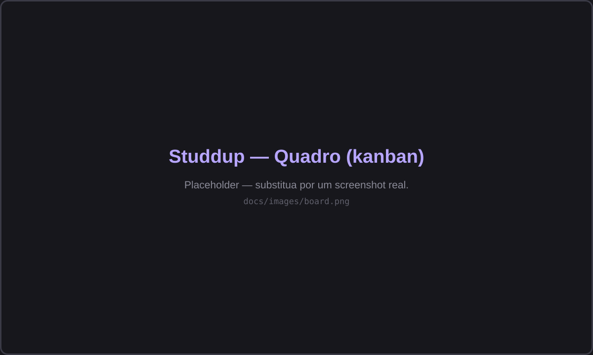
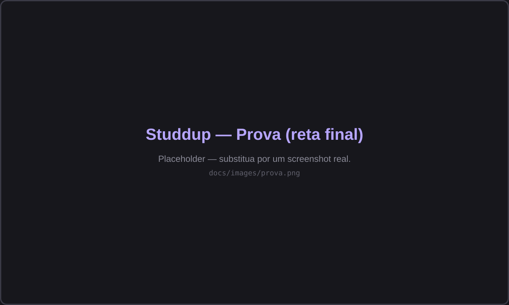
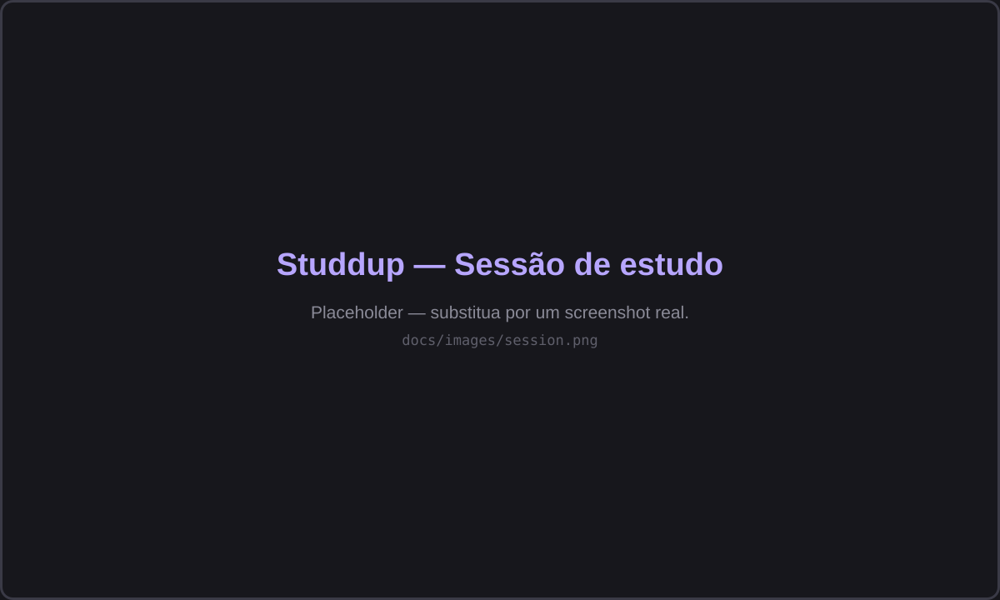

# Studdup

**A calm, non-punitive desktop study planner.** Studdup answers the two questions most study tools
leave to you: **when** to study a topic, and **how** to study it during a session — then gets out of
your way. No streaks, no scores, no guilt. Everything is offline and lives in one local file.

- **Method** (the *when*) — the scheduling philosophy, fixed per card: **Repetição Espaçada** (a
  fixed review ladder) or **Prova** (sessions spread out toward an exam date).
- **Technique** (the *how*) — an optional guided session that runs when you start studying: Pomodoro,
  Active Recall, Feynman, or Leitner.

Your cards live on a four-column board — **Hoje / Amanhã / Próximos / Concluídos** — and a card only
moves forward when you actually study it. It's a single-user, **offline** desktop app: all data is in
one local SQLite file, with no accounts, no cloud, and no network.

---

## Download & install

Grab the latest installer for your system from the **[Releases page](https://github.com/gabecmelo/Studdup/releases/latest)**.

| OS | File | How to install |
| --- | --- | --- |
| **Windows** | `studdup_*_x64-setup.exe` | Run the installer. Windows SmartScreen may warn about an unknown publisher (the app is unsigned) — choose **More info → Run anyway**. |
| **macOS** | `studdup_*.dmg` | Open the `.dmg` and drag **Studdup** into Applications. On first launch, right-click the app → **Open** to get past Gatekeeper (the app is unsigned). |
| **Linux** | `studdup_*_amd64.AppImage` | `chmod +x studdup_*_amd64.AppImage` then run it. No install needed. |
| **Linux (Debian/Ubuntu)** | `studdup_*_amd64.deb` | `sudo apt install ./studdup_*_amd64.deb` |

Prefer to build from source? See **[SETUP.md](SETUP.md)**.

---

## Quick start

1. **Create a card** with **Novo Card**. Give it a title, pick a **method** (Espaçada or Prova), and
   optionally a **technique**. A `(?)` next to each choice explains how it works in the app.
2. The card appears on the **Quadro** in the right column based on when it's due.
3. **Click the card** to open it, then **Estudar** to start the session. There is no dragging —
   a card advances only by studying it.
4. When you finish, **Concluir** records the session and schedules the next one.
5. Can't study today? Open the card and use **Adiar** to push it out (with a gentle 5-minute review
   nudge for reviews).

Everything you do is logged in **Histórico** — a plain record of what you studied, never a score.

---

## Study methods

| Method | When to use it | How it schedules |
| --- | --- | --- |
| **Repetição Espaçada** | Open-ended learning with no deadline | A fixed ladder — Dia 0 → 1 → 2 → 5 → 15 → 30 → Concluído. A card's due date is always `start_date + stage`, so the schedule can never desynchronize. |
| **Prova** | Material with a known exam date | Sessions are distributed from today to the exam date, back-loaded so reviews get denser as the exam approaches. Finishing the last session archives the card. You can study several sessions in one day (cramming is allowed). |

## Study techniques

A card may carry one optional technique (or none). Each has a default estimated session length you
can override per card (5–180 minutes).

| Technique | What the session does | Default estimate |
| --- | --- | --- |
| **Pomodoro** | Timed focus blocks with breaks, using the card's rhythm (25/5, 50/10, 90/20, or custom) across a chosen number of cycles (default 4). Pause/resume holds the exact remaining time. | cycles × focus |
| **Active Recall** | Write what you remember from memory, then reveal the source to compare. Your written attempts are saved on the card. | 20 min |
| **Feynman** | Explain the topic in plain language, then compare with the source. Attempts are saved on the card. | 20 min |
| **Leitner** | Box-based flashcard review: right answers promote a card up the boxes, wrong ones reset it to box 1. | 15 min |

Cards without a technique get a plain session screen with the material links and a single
**Concluir** action.

---

## Reporting bugs & requesting features

Found a problem or have an idea? **[Open an issue](https://github.com/gabecmelo/Studdup/issues/new/choose)** —
there are templates for bug reports and feature requests. Please include your OS and app version
(shown in the release you installed) for bugs.

## Contributing

Contributions are welcome. Start with **[CONTRIBUTING.md](CONTRIBUTING.md)** for how to set up the
project, the commit conventions, and how changes are reviewed. The developer setup (build, run,
test) lives in **[SETUP.md](SETUP.md)**, and the architecture is documented in
**[ARCHITECTURE.md](ARCHITECTURE.md)**.

## License

Studdup is open source under the **[MIT License](LICENSE)**.
